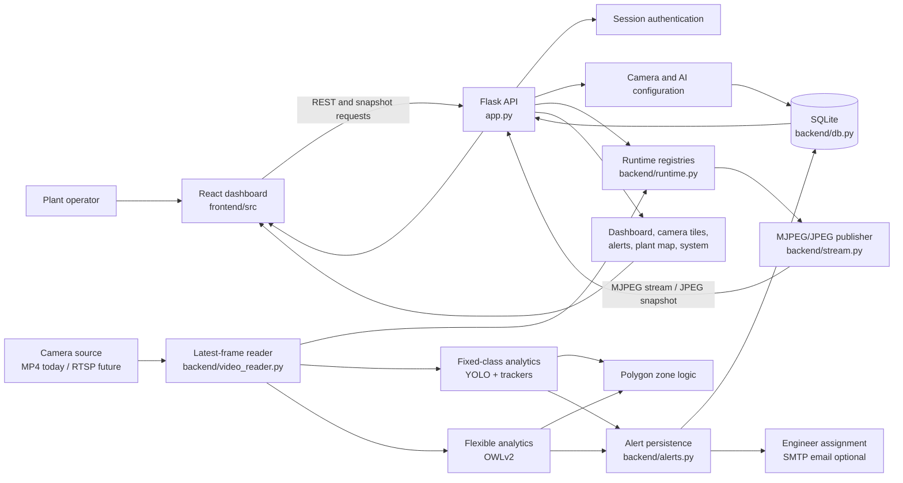
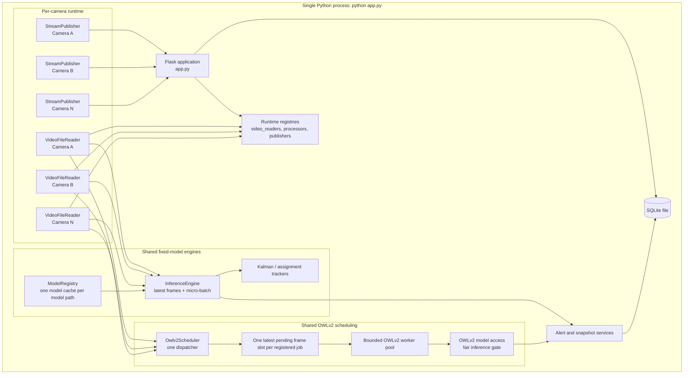
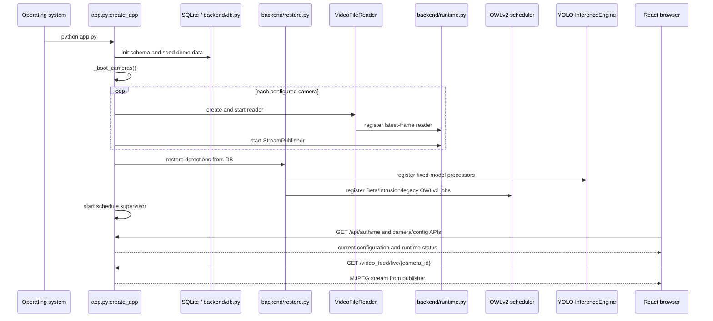
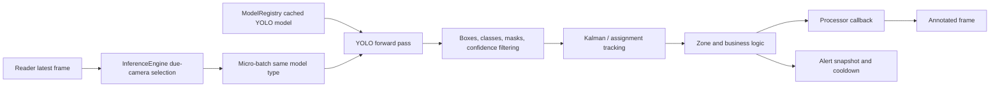
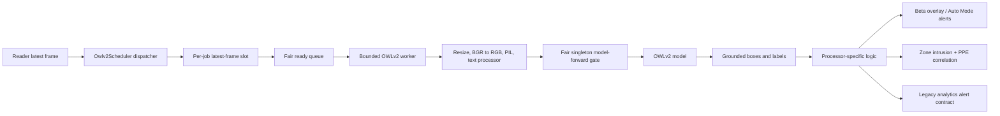
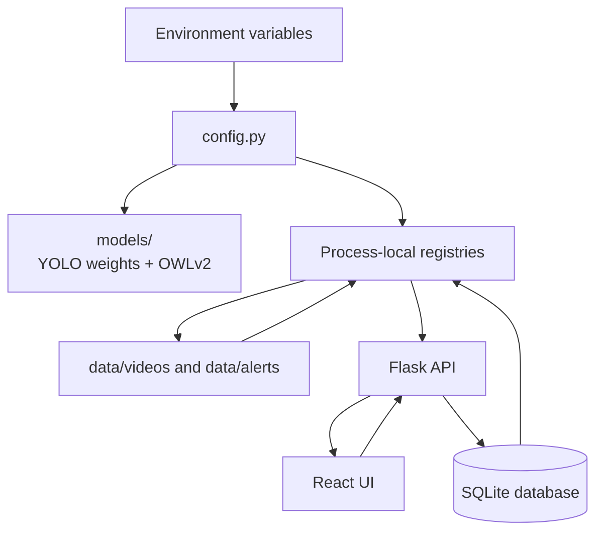
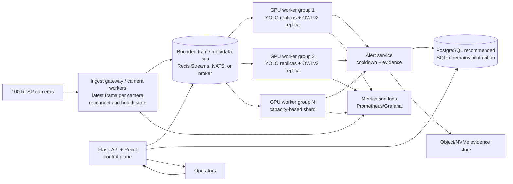

# Food Industry Vision AI Platform Architecture

## 1. Scope and Design Intent

This document describes the current VMS architecture, the functional flow of a camera event, the module-level interactions, and the deployment architecture required for a 100-camera industrial installation.

The application is intentionally demo-first:

- Flask and SQLite provide a low-friction single-facility deployment.
- React and Vite provide the configuration and monitoring UI.
- OpenCV reads looped video files today; the database already stores `rtsp_url` for future live ingest.
- YOLO handles known, stable classes at high throughput.
- OWLv2 handles operator-defined labels without retraining.
- The current process contains the API, camera readers, display publishers, and AI workers.
- The scalable deployment separates those responsibilities into API, ingest, and GPU inference processes.

The diagrams below describe both states explicitly. A diagram labelled **Current** reflects code that exists in this repository. A diagram labelled **Target** is the recommended enterprise deployment model.

## 2. Functional Architecture



### Functional responsibilities

| Capability | Functional behavior | Primary implementation |
| --- | --- | --- |
| Authentication | Login, logout, session guard, default demo user | `app.py`, `backend/db.py` |
| Camera management | Add, update, delete, upload video, resolve portable paths | `app.py`, `backend/db.py`, `config.py` |
| Video ingest | Loop MP4, rotate frames, retain newest frame | `backend/video_reader.py` |
| Live view | Encode the latest rendered frame as JPEG/MJPEG | `backend/stream.py`, `backend/display_frame.py` |
| Fixed detection | Headcount, entry/exit, flap gate, workforce, PPE, fire/smoke, ANPR | `backend/analytics_runtime.py`, specialist processors |
| Flexible detection | Per-camera text labels and open-vocabulary object detection | `backend/beta_ai.py`, `backend/intrusion_processor.py` |
| Zone logic | Polygon containment and zone-specific state transitions | `backend/analytics_runtime.py`, specialist processors |
| Alerts | Snapshot, type, severity, cooldown, metadata | `backend/alerts.py`, `backend/db.py` |
| Response workflow | Assign alert to engineer and optionally email | `app.py`, `backend/mailer.py` |
| Scheduling | Shift-based enable/disable of Beta and Auto Mode | `backend/schedule_supervisor.py`, `backend/schedule_util.py` |
| Configuration UI | Cameras, AI types, zones, schedules, plant map, system settings | `frontend/src/pages`, `frontend/src/components` |

## 3. Current Process Topology

The current deployment is a single Python process. Threads are used for camera decode, display publishing, fixed-model engines, and OWLv2 scheduling.



### Current topology facts

1. `app.py` creates or stops a `VideoFileReader` and `StreamPublisher` for each camera.
2. `backend/runtime.py` stores process-local dictionaries for readers, publishers, and processors.
3. A reader owns one latest-frame slot, not an unbounded frame queue.
4. `StreamPublisher` renders the current display frame and JPEG-encodes it at the configured display rate.
5. YOLO processors register with shared `InferenceEngine` instances. The engine gathers due cameras and micro-batches frames for one model.
6. OWLv2 processors register with `backend/owlv2_scheduler.py`. The dispatcher rotates its polling cursor across readers, replaces stale pending frames, and feeds bounded workers.
7. `backend/beta_ai.py` owns the primary OWLv2 model and a fair model-forward gate. Intrusion and legacy analytics retain processor-specific post-processing and alert contracts.
8. SQLite is the source of configuration and alert persistence. Runtime dictionaries are not durable state.
9. `/api/health` and `/api/system-stats` report OWLv2 scheduler counters without initializing the scheduler when no workload is active.
9. Flask startup restores cameras, detections, Beta configuration, Auto Mode, and schedules from SQLite.

## 4. Startup and Restore Sequence



## 5. Per-Frame Data Flow

### 5.1 Ingest and display path


The display path is intentionally independent of inference completion. If an AI model is busy, the camera can still provide the newest live frame or the most recent annotated frame.

The cloned-feed benchmark intentionally compares the bounded scheduler with
the previous unlimited polling-thread pattern. The scheduler may report lower
synthetic callback throughput because it enforces the configured worker limit;
that is expected. The relevant production signals are frame age, dropped stale
work, model latency, CPU/RAM, GPU utilization, and alert latency.

### 5.2 YOLO path



YOLO is the high-throughput tier. Its shared `InferenceEngine` is the correct abstraction for batching frames from cameras using the same model and detection configuration.

### 5.3 OWLv2 path



The scheduler is a load-shedding boundary. It deliberately drops stale frames when the model is saturated. It does not increase the raw inference capacity of one OWLv2 model. The singleton forward gate remains required for model safety in the current process.

## 6. Module and Symbol Map

### Application and API

| Module | Important symbols | Interaction |
| --- | --- | --- |
| `app.py` | `create_app`, `_boot_cameras`, `_start_camera`, `_stop_camera`, `_start_beta_processors` | Flask routes, startup, camera lifecycle, configuration restore, processor lifecycle |
| `config.py` | `VLM_DEVICE`, `OWLV2_*`, `TARGET_FPS`, `MICRO_BATCH`, model paths | Environment-controlled runtime behavior and model resolution |
| `backend/db.py` | `get_db`, `init_db`, seed and CRUD helpers | SQLite schema, camera records, detection configs, alerts, engineers |
| `backend/runtime.py` | `video_readers`, `stream_publishers`, processor registries | Process-local live object registry |
| `backend/restore.py` | `restore_detections_from_db`, `start_detection_instance` | Recreates configured processors after startup |

### Video and presentation

| Module | Important symbols | Interaction |
| --- | --- | --- |
| `backend/video_reader.py` | `VideoFileReader.start`, `_read_loop`, `get_frame`, `stop` | One latest decoded frame per camera; source pacing and rotation |
| `backend/stream.py` | `StreamPublisher`, `start_stream_publisher`, `get_jpeg` | Render and encode camera output for browser clients |
| `backend/display_frame.py` | `build_display_frame` | Selects live frame and active processor overlays |

### Fixed-class AI

| Module | Important symbols | Interaction |
| --- | --- | --- |
| `backend/analytics_runtime.py` | `ModelRegistry`, `InferenceEngine`, `get_inference_engine` | Shared YOLO model cache, locks, batching, callback dispatch |
| `backend/analytics_runtime.py` | `HeadCountProcessor`, `EntryExitProcessor`, `FlapGateProcessor` | Tracking and zone state machines |
| `backend/analytics_runtime.py` | `PPEDetectionProcessor`, `FireSmokeDetectionProcessor` | PPE and fire/smoke business rules |
| `backend/anpr_processor.py` | ANPR processor | Vehicle, plate, OCR, and speed pipeline |
| `backend/workforce_processor.py` | Workforce processor | Person/machine zone dwell and away alerts |

### Flexible AI and scheduling

| Module | Important symbols | Interaction |
| --- | --- | --- |
| `backend/owlv2_scheduler.py` | `Owlv2Scheduler`, `register`, `submit`, `stats`, `stop` | Bounded latest-frame dispatch across OWLv2 jobs |
| `backend/beta_ai.py` | `_get_owlv2`, `BetaOwlv2Processor`, `_owlv2_infer_lock` | Primary OWLv2 model, preprocessing, decoding, Beta callbacks |
| `backend/intrusion_processor.py` | `IntrusionDetectionProcessor` | Scheduler callback plus zone and PPE correlation |
| `backend/automode.py` | `AutoModeOwlv2Processor`, `start_automode_processors` | Reuses Beta scheduler path with Auto Mode alert behavior |
| `backend/schedule_supervisor.py` | `enforce_schedules`, `start_schedule_supervisor` | Starts and stops configured Beta/Auto Mode workloads by shift |

### Alert and operational services

| Module | Important symbols | Interaction |
| --- | --- | --- |
| `backend/alerts.py` | `save_alert_event` | Cooldown, snapshot persistence, alert record creation |
| `backend/mailer.py` | SMTP helpers | Optional response-engineer notification |
| `backend/dashboard.py` | Dashboard aggregation | Runtime counts and status summaries |
| `backend/analytics_runtime.py` | `Watchdog`, `CUDACacheSteward` | Health, cache, and GPU memory support for fixed-model runtime |

## 7. Configuration and State Boundaries



### Durable versus ephemeral state

- Durable: camera definitions, detection configurations, zone polygons, schedules, users, engineers, alerts, and SMTP settings in SQLite.
- Ephemeral: decoded frames, publisher JPEG buffers, active processors, model objects, scheduler queues, tracker state, and thread health.
- Evidence: alert snapshots are stored under the configured alerts directory and referenced by alert records.
- Configuration portability: camera paths are remapped by filename under `VISION_VIDEOS_DIR`; model paths are resolved from `models/` and the repository root.

## 8. Target Enterprise Deployment for 100 Cameras

The current single-process design is appropriate for a demo and small pilot. For 100 cameras, use process isolation by workload and GPU. Keep the browser/API path responsive even when inference is saturated.



### Target process responsibilities

| Process group | Responsibility | Isolation rule |
| --- | --- | --- |
| API/control plane | Flask routes, authentication, configuration, alert queries, UI serving | No model forward pass; restart independently |
| Ingest workers | RTSP/file decode, reconnect, latest-frame retention, camera health | Bound camera count per process; no unbounded queues |
| YOLO GPU workers | Shared model replicas, cross-camera micro-batching, tracking callbacks | Pin process to one GPU; one replica per model family per worker |
| OWLv2 GPU workers | Text-label batches, open-vocabulary inference, per-camera post-processing | Pin process to one GPU; bounded worker count and model memory budget |
| Alert/evidence service | Cooldown, durable alert events, snapshot storage, notifications | Decouple disk/network latency from inference workers |
| Metrics service | FPS, queue age, drops, latency, GPU/CPU/memory, health | Retain time-series data outside application process |

### Scheduling policy

1. Assign each camera a workload profile: fixed YOLO, OWLv2, or both.
2. Give every model task a maximum inference frequency. Safety-critical tasks receive higher priority than exploratory labels.
3. Keep only the newest frame for each camera/model task unless a business rule explicitly needs temporal history.
4. Batch cameras using the same model, image size, and label set. Avoid batching cameras with incompatible post-processing contracts.
5. Route a camera group to one GPU worker shard to keep tracker state local.
6. Use a bounded queue and expose queue age. Drop work when the frame is older than the configured maximum age.
7. Persist alerts asynchronously after the inference result is produced.
8. Restart unhealthy workers without restarting the control plane or all cameras.

## 9. Hardware Sizing Assumptions

The following is a starting configuration, not a certification claim. Final sizing requires measurement with the exact camera resolutions, model weights, labels, alert rate, and target FPS.

### Minimum practical enterprise pilot

- 16 to 24 CPU cores.
- 64 GB RAM.
- 1 TB or larger NVMe for local evidence and logs.
- 10 GbE networking where camera traffic is centralized.
- Two NVIDIA L4 24 GB GPUs, or equivalent inference GPUs.
- Separate API/control-plane process and GPU worker processes.
- PostgreSQL for durable multi-process state; SQLite is acceptable only when the deployment remains single-process.

### Calculation assumptions

- 100 cameras, mostly 720p, with a smaller 1080p tier.
- Display streaming is sampled independently from AI inference.
- Fixed YOLO models run at approximately 2 to 10 FPS depending on use case and risk tier.
- OWLv2 is sampled at a lower rate, for example 0.2 to 1 FPS per camera, unless a safety workflow justifies more.
- Approximately three logical model tasks per camera does not mean three full-rate forwards per camera.
- Model replicas are sharded across GPUs; one global process lock is not used across the deployment.
- Camera decoding, JPEG streaming, inference, alert persistence, and notifications have separate resource budgets.

The previous local measurement on an Apple M4 showed approximately 0.73 OWLv2 FPS for one model replica and 1.37 seconds p50 latency. That result demonstrates why three full-rate models for every camera cannot be projected from one desktop process. GPU worker count must be selected from measured model throughput and the permitted sampling rate:

```text
required_model_capacity = sum(camera_task_target_fps)
worker_count >= required_model_capacity / measured_replica_fps
```

Add at least 30 percent headroom for burst load, preprocessing, post-processing, and model warm-up.

## 10. Observability Contract

Every ingest and inference worker should expose the following metrics. The current OWLv2 scheduler already exposes several of these in its `stats` property.

| Metric | Meaning | Required action |
| --- | --- | --- |
| `camera_active` | Reader is receiving frames | Alert on disconnect or stale timestamp |
| `frame_age_ms` | Age of frame selected for inference | Drop or deprioritize old work |
| `submitted_total` | Work accepted by scheduler | Capacity denominator |
| `completed_total` | Work completed successfully | Throughput numerator |
| `dropped_total` | Stale work replaced or discarded | Capacity pressure signal |
| `inference_latency_ms` | Model forward plus post-processing time | Sizing and SLO input |
| `queue_depth` | Pending camera/model jobs | Backlog pressure |
| `alert_latency_ms` | Detection to durable alert time | Safety workflow SLO |
| `gpu_utilization` | GPU compute utilization | Detect underuse and saturation |
| `gpu_memory_used` | Model and tensor memory | Prevent OOM and unsafe replica count |
| `process_restarts_total` | Worker reliability | Capacity and fault analysis |

The current process exposes scheduler `workers`, `active_cameras`,
`queued_cameras`, `submitted`, `completed`, `dropped`, `errors`, and
`completion_ratio` through the existing health and system-stat endpoints.

`backend/inference_protocol.py` defines the common `InferenceRequest` and
`InferenceResult` contracts. `group_compatible_requests` groups OWLv2 requests
only when the model key and ordered labels match. `backend/gpu_worker.py`
consumes those requests through bounded multiprocessing queues, loads one model
replica inside the GPU worker, and returns results through a bounded result
queue.

## 11. Current Limits and Migration Priorities

The current scheduler is a significant control-plane improvement, but the following limits remain before the target can be claimed as a production result:

1. The current scheduler is process-local. Multi-GPU sharding and worker supervision are deployment responsibilities, not implemented by `python app.py`.
2. The primary OWLv2 model forward remains serialized by a process-local fair gate. Additional throughput requires model replicas in separate GPU workers.
3. The legacy analytics module has its own OWLv2 model-loading globals, so model ownership is not yet fully unified across every code path.
4. The existing benchmark demonstrates 100-camera admission and stale-frame control, not 100 cameras running three real AI models at target FPS.
5. A real three-clone Beta OWLv2 replay completed 6 inferences in 24 seconds (0.25 aggregate FPS) with 576 stale submissions dropped and 0 scheduler errors; one in-process serialized replica cannot meet high-rate multi-camera inference.
6. RTSP ingest, reconnect policy, network jitter handling, and camera health persistence require a production ingest worker.
7. SQLite is not the preferred durable store for multiple inference processes writing alerts concurrently.
8. GPU utilization, end-to-end alert latency, and per-camera SLOs still need to be measured on the proposed NVIDIA hardware.

Recommended implementation order:

1. Add a process supervisor and GPU worker configuration.
2. Move frame transport to a bounded inter-process bus or co-located camera/inference shards.
3. Unify OWLv2 model loading and label-batch handling within each worker.
4. Add a real 100-camera replay benchmark with three configured model tasks per camera.
5. Record p50/p95 inference latency, camera FPS, queue age, drops, CPU, RAM, GPU utilization, GPU memory, and alert latency.
6. Replace or harden SQLite for multi-process deployments.

## 12. Requirement Traceability

| Expected deliverable | Current status |
| --- | --- |
| Updated source and architecture changes | Shared latest-frame OWLv2 scheduler and processor integrations are implemented |
| Camera/model process model | Current single-process model documented; target GPU-sharded model specified |
| Hardware recommendation | Two 24 GB inference GPUs, 16-24 CPU cores, 64 GB RAM, NVMe, 10 GbE starting point |
| Performance results | Local M4 baseline and scheduler stress results documented in `README.md` |
| Remaining bottlenecks | Serialized OWLv2, process-local scheduler, SQLite, RTSP and multi-GPU gaps documented above |
| Preserve application purpose | Existing camera, zone, alert, scheduling, UI, YOLO, OWLv2, and engineer workflows retained |
