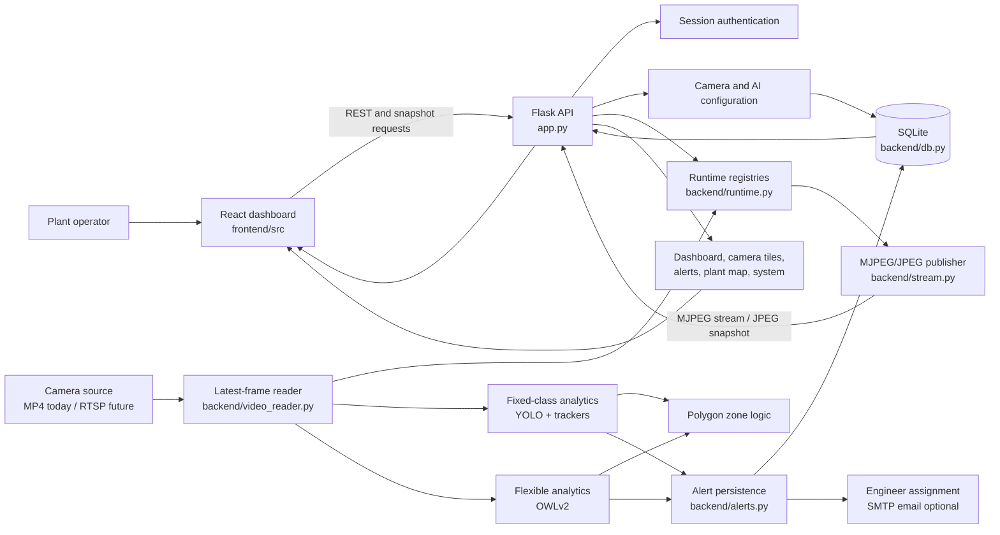
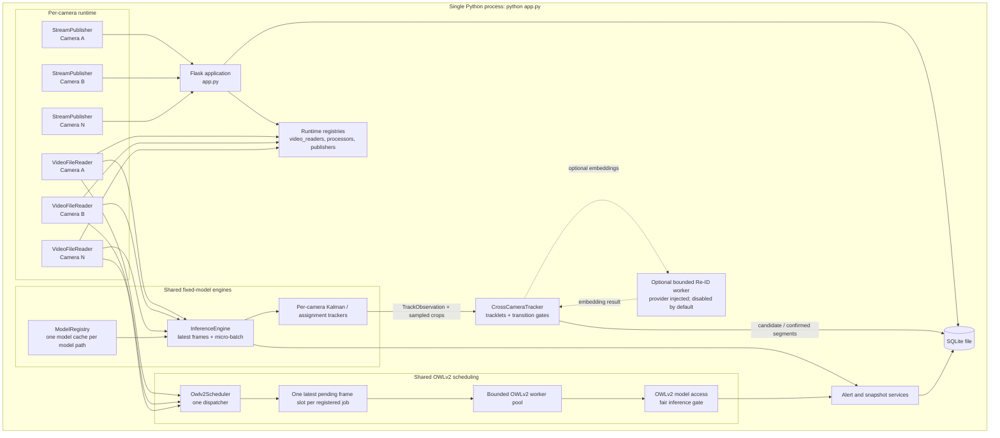
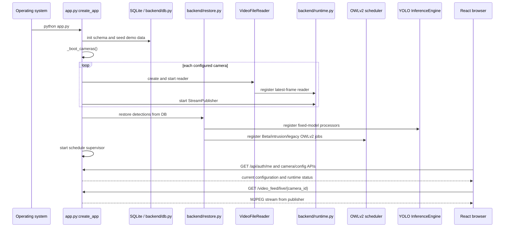
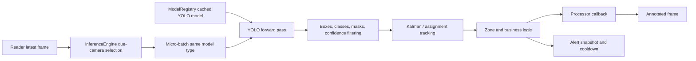
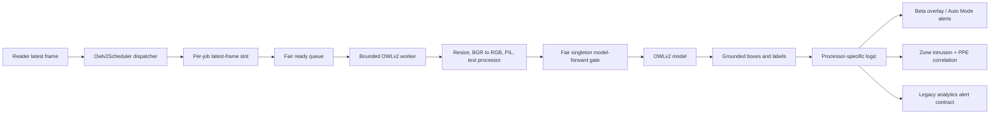
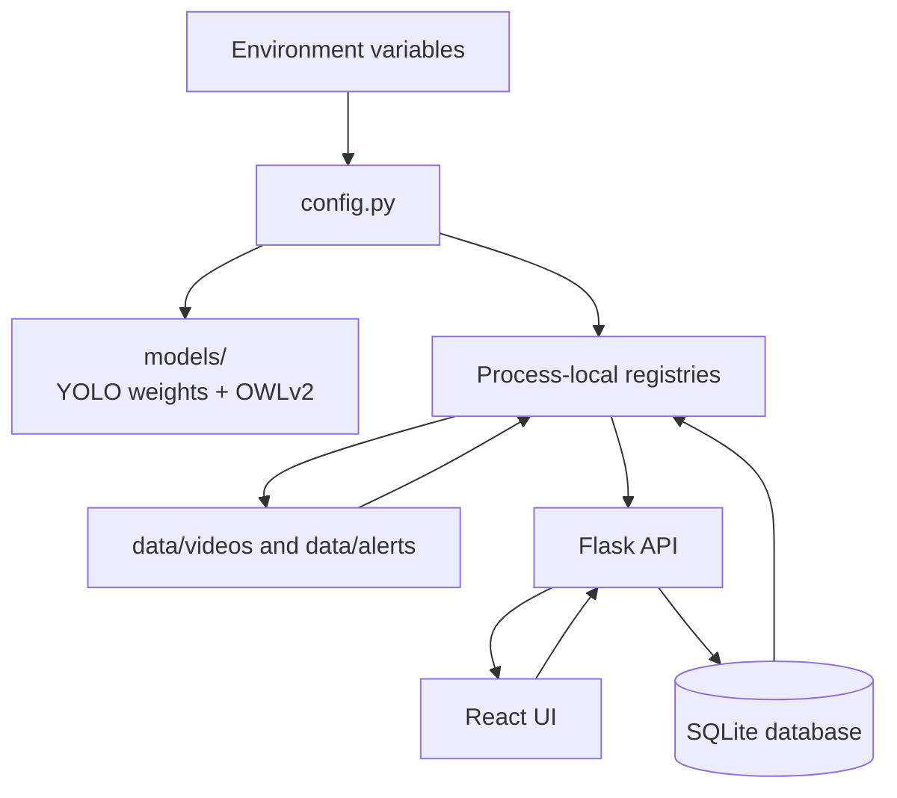
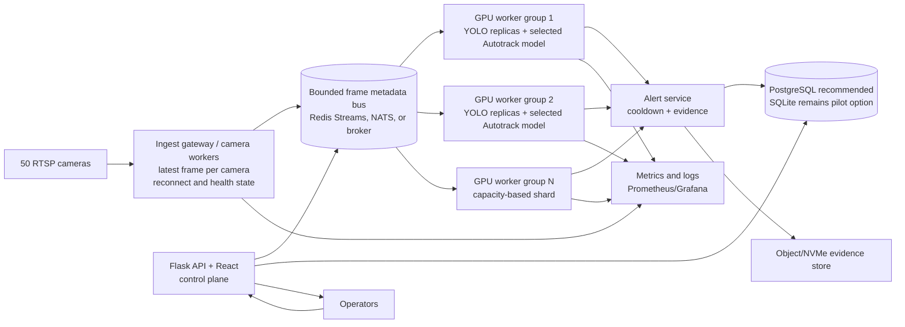

# Food Industry Vision AI Platform Architecture

## 1. Scope and Design Intent

This document describes the current VMS architecture, the functional flow of a camera event, the module-level interactions, and the deployment architecture for the revised 50-camera target. See `VMS_SCALING_ROADMAP.md` for phased validation and acceptance criteria.

The application is intentionally demo-first:

- Flask and SQLite provide a low-friction single-facility deployment.
- React and Vite provide the configuration and monitoring UI.
- OpenCV reads looped video files today; the database already stores `rtsp_url` for future live ingest.
- YOLO handles known, stable classes at high throughput.
- OWLv2 handles operator-defined labels without retraining.
- The current process contains the API, camera readers, display publishers, and AI workers.
- The scalable deployment separates those responsibilities into API, ingest, and GPU inference processes.

The diagrams below describe both states explicitly. A diagram labelled **Current** reflects code that exists in this repository. A diagram labelled **Target** is the recommended enterprise deployment model.

## 2. Functional Architecture


```mermaid
flowchart LR
    Operator[Plant operator]
    Browser[React dashboard\nfrontend/src]
    API[Flask API\napp.py]
    Auth[Session authentication]
    Config[Camera and AI configuration]
    DB[(SQLite\nbackend/db.py)]
    Runtime[Runtime registries\nbackend/runtime.py]
    Camera[Camera source\nMP4 today / RTSP future]
    Reader[Latest-frame reader\nbackend/video_reader.py]
    Publisher[MJPEG/JPEG publisher\nbackend/stream.py]
    Fixed[Fixed-class analytics\nYOLO + trackers]
    Flexible[Flexible analytics\nOWLv2]
    Zones[Polygon zone logic]
    Alerts[Alert persistence\nbackend/alerts.py]
    Notify[Engineer assignment\nSMTP email optional]
    Views[Dashboard, camera tiles,\nalerts, plant map, system]

    Operator --> Browser
    Browser -->|REST and snapshot requests| API
    API --> Auth
    API --> Config
    Config --> DB
    API --> Runtime
    Camera --> Reader
    Reader --> Runtime
    Runtime --> Publisher
    Publisher -->|MJPEG stream / JPEG snapshot| API
    API --> Browser
    Reader --> Fixed
    Reader --> Flexible
    Fixed --> Zones
    Flexible --> Zones
    Fixed --> Alerts
    Flexible --> Alerts
    Alerts --> DB
    Alerts --> Notify
    DB --> API
    API --> Views
    Views --> Browser
```

### Functional responsibilities

| Capability | Functional behavior | Primary implementation |
| --- | --- | --- |
| Authentication | Login, logout, session guard, default demo user | `app.py`, `backend/db.py` |
| Camera management | Add, update, delete, upload video, resolve portable paths | `app.py`, `backend/db.py`, `config.py` |
| Video ingest | Loop MP4, rotate frames, retain newest frame | `backend/video_reader.py` |
| Live view | Encode the latest rendered frame as JPEG/MJPEG | `backend/stream.py`, `backend/display_frame.py` |
| Fixed detection | Headcount, entry/exit, flap gate, workforce, PPE, fire/smoke, ANPR | `backend/analytics_runtime.py`, specialist processors |
| Flexible detection | Per-camera text labels and open-vocabulary object detection | `backend/beta_ai.py`, `backend/intrusion_processor.py` |
| Zone logic | Polygon containment and zone-specific state transitions | `backend/analytics_runtime.py`, specialist processors |
| Alerts | Snapshot, type, severity, cooldown, metadata | `backend/alerts.py`, `backend/db.py` |
| Response workflow | Assign alert to engineer and optionally email | `app.py`, `backend/mailer.py` |
| Scheduling | Shift-based enable/disable of Beta and Auto Mode | `backend/schedule_supervisor.py`, `backend/schedule_util.py` |
| Configuration UI | Cameras, AI types, zones, schedules, plant map, system settings | `frontend/src/pages`, `frontend/src/components` |

## 3. Current Process Topology

The current deployment is a single Python process. Threads are used for camera decode, display publishing, fixed-model engines, and OWLv2 scheduling.


```mermaid
flowchart TB
    subgraph Process[Single Python process: python app.py]
        Flask[Flask application\napp.py]
        Registries[Runtime registries\nvideo_readers, processors, publishers]
        DB[(SQLite file)]

        subgraph Cameras[Per-camera runtime]
            Reader1[VideoFileReader\nCamera A]
            Reader2[VideoFileReader\nCamera B]
            ReaderN[VideoFileReader\nCamera N]
            Pub1[StreamPublisher\nCamera A]
            Pub2[StreamPublisher\nCamera B]
            PubN[StreamPublisher\nCamera N]
        end

        subgraph YOLO[Shared fixed-model engines]
            Registry[ModelRegistry\none model cache per model path]
            Engine[InferenceEngine\nlatest frames + micro-batch]
            Trackers[Per-camera Kalman / assignment trackers]
        end

        CrossCamera[CrossCameraTracker\ntracklets + transition gates]
        ReID[Optional bounded Re-ID worker\nprovider injected; disabled by default]

        subgraph VLM[Shared OWLv2 scheduling]
            Dispatch[Owlv2Scheduler\none dispatcher]
            Slots[One latest pending frame slot per registered job]
            Workers[Bounded OWLv2 worker pool]
            Model[OWLv2 model access\nfair inference gate]
        end

        Alerts[Alert and snapshot services]
    end

    Flask --> Registries
    Flask --> DB
    Reader1 --> Registries
    Reader2 --> Registries
    ReaderN --> Registries
    Reader1 --> Dispatch
    Reader2 --> Dispatch
    ReaderN --> Dispatch
    Dispatch --> Slots --> Workers --> Model
    Reader1 --> Engine
    Reader2 --> Engine
    ReaderN --> Engine
    Registry --> Engine
    Engine --> Trackers
    Trackers -->|TrackObservation + sampled crops| CrossCamera
    CrossCamera -. optional embeddings .-> ReID
    ReID -. embedding result .-> CrossCamera
    CrossCamera -->|candidate / confirmed segments| DB
    Engine --> Alerts
    Model --> Alerts
    Pub1 --> Flask
    Pub2 --> Flask
    PubN --> Flask
    Alerts --> DB
```

### Current topology facts

1. `app.py` creates or stops a `VideoFileReader` and `StreamPublisher` for each camera.
2. `backend/runtime.py` stores process-local dictionaries for readers, publishers, and processors.
3. A reader owns one latest-frame slot, not an unbounded frame queue. `get_frame()` returns a defensive copy by default; display publishing and YOLO/OWLv2 scheduling borrow the current frame reference on internal read-only paths. The reader replaces the reference and does not mutate a published array; annotation callbacks copy before drawing.
4. `StreamPublisher` renders and encodes at the configured display rate for recently requested feeds, and falls back to 1 FPS for idle cameras so snapshots remain fresh without encoding every camera at the active-feed rate.
5. YOLO processors register with shared `InferenceEngine` instances. The engine gathers due cameras and micro-batches frames for one model.
6. OWLv2 processors register with `backend/owlv2_scheduler.py`. The dispatcher rotates its polling cursor across readers, replaces stale pending frames, and feeds bounded workers.
7. `backend/beta_ai.py` owns the primary OWLv2 model and a fair model-forward gate. Intrusion and legacy analytics retain processor-specific post-processing and alert contracts.
8. SQLite is the source of configuration and alert persistence. Runtime dictionaries are not durable state.
9. `/api/health` and `/api/system-stats` report OWLv2 scheduler counters without initializing the scheduler when no workload is active.
9. Flask startup restores cameras, detections, Beta configuration, Auto Mode, and schedules from SQLite.

## 4. Startup and Restore Sequence


```mermaid
sequenceDiagram
    participant OS as Operating system
    participant App as app.py:create_app
    participant DB as SQLite / backend/db.py
    participant Restore as backend/restore.py
    participant Reader as VideoFileReader
    participant Runtime as backend/runtime.py
    participant Sched as OWLv2 scheduler
    participant Engine as YOLO InferenceEngine
    participant UI as React browser

    OS->>App: python app.py
    App->>DB: init schema and seed demo data
    App->>App: _boot_cameras()
    loop each configured camera
        App->>Reader: create and start reader
        Reader->>Runtime: register latest-frame reader
        App->>Runtime: start StreamPublisher
    end
    App->>Restore: restore detections from DB
    Restore->>Engine: register fixed-model processors
    Restore->>Sched: register Beta/intrusion/legacy OWLv2 jobs
    App->>App: start schedule supervisor
    UI->>App: GET /api/auth/me and camera/config APIs
    App-->>UI: current configuration and runtime status
    UI->>App: GET /video_feed/live/{camera_id}
    App-->>UI: MJPEG stream from publisher
```

## 5. Per-Frame Data Flow

### 5.1 Ingest and display path


```mermaid
flowchart LR
    Source[MP4 or future RTSP source]
    Capture[OpenCV VideoCapture]
    Decode[VideoFileReader._read_loop]
    Latest[reader.frame\nreplace newest frame]
    Build[display_frame.build_display_frame]
    Overlay[processor.render_display_frame]
    Encode[cv2.imencode JPEG]
    HTTP[Flask MJPEG response]
    Browser[CameraFeedTile]

    Source --> Capture --> Decode --> Latest
    Latest --> Build
    Build --> Overlay
    Overlay --> Encode --> HTTP --> Browser
```

The display path is intentionally independent of inference completion. If an AI model is busy, the camera can still provide the newest live frame or the most recent annotated frame.

The cloned-feed benchmark intentionally compares the bounded scheduler with
the previous unlimited polling-thread pattern. The scheduler may report lower
synthetic callback throughput because it enforces the configured worker limit;
that is expected. The relevant production signals are frame age, dropped stale
work, model latency, CPU/RAM, GPU utilization, and alert latency.

### 5.2 YOLO path


```mermaid
flowchart LR
    Latest[Reader latest frame]
    Due[InferenceEngine due-camera selection]
    Batch[Micro-batch same model type]
    Registry[ModelRegistry cached YOLO model]
    Forward[YOLO forward pass]
    Post[Boxes, classes, masks, confidence filtering]
    Track[Kalman / assignment tracking]
    Logic[Zone and business logic]
    Callback[Processor callback]
    Alert[Alert snapshot and cooldown]
    Overlay[Annotated frame]

    Latest --> Due --> Batch
    Registry --> Forward
    Batch --> Forward --> Post --> Track --> Logic
    Logic --> Callback
    Logic --> Alert
    Callback --> Overlay
```

YOLO is the high-throughput tier. Its shared `InferenceEngine` is the correct abstraction for batching frames from cameras using the same model and detection configuration.

The headcount and entry/exit person trackers retain their camera-local IDs and
also submit `TrackObservation` updates to `backend/cross_camera_tracking.py`.
Observations are grouped into bounded tracklets. A tracklet is closed after a
configurable inactivity gap; camera transitions then gate candidates by
elapsed time and optional source/destination zones. Entry/exit processors
provide their configured `entry` and `exit` zones. The API exposes transition
rules at `GET`/`PUT /api/camera-transitions` and current candidate associations
at `GET /api/cross-camera/candidates`.

Re-ID is an optional asynchronous path with **OSNet-AIN x1.0 through
Torchreid** as the proposed first baseline. `backend/reid/torchreid_osnet.py`
implements the provider contract with 256 x 128 RGB preprocessing and
normalized float32 embeddings. The checkpoint is a separately reviewed local
artifact; no weights are bundled. Enablement is off by default and requires an
explicit enable flag, approved plant validation dataset, and threshold derived
from that validation. Quality-gated crops enter a bounded queue, and overloaded
queues drop samples rather than stalling YOLO. See
`models/reid/osnet_ain_x1_0/MODEL_CARD.md` for artifact review and validation
steps. Candidate scores are uncalibrated ranking values (cosine similarity
when embeddings are available, otherwise temporal fit), not identity
probabilities; no fixed appearance/time blend is treated as a production score.

Topology and appearance results are **candidate associations**, not confirmed
identities. An authenticated operator can confirm a candidate through
`POST /api/cross-camera/candidates/{candidate_id}/confirm`, optionally attaching
it to an existing global track. Confirmation persists a `global_tracks` record
and the two observed `global_track_segments` in SQLite. The local IDs remain
unchanged. `GET /api/cross-camera/global-tracks` returns segments and advances
persisted status through `active`, `temporarily_lost`, and `closed` using the
configured identity timeout. Candidate state and Re-ID embeddings remain
process-local; durable embeddings and automatic identity confirmation are not
implemented.

### 5.3 OWLv2 path


```mermaid
flowchart LR
    Latest[Reader latest frame]
    Poll[Owlv2Scheduler dispatcher]
    Slot[Per-job latest-frame slot]
    Ready[Fair ready queue]
    Worker[Bounded OWLv2 worker]
    Pre[Resize, BGR to RGB, PIL, text processor]
    Gate[Fair singleton model-forward gate]
    Model[OWLv2 model]
    Decode[Grounded boxes and labels]
    Specific[Processor-specific logic]
    Beta[Beta overlay / Auto Mode alerts]
    Intrusion[Zone intrusion + PPE correlation]
    Legacy[Legacy analytics alert contract]

    Latest --> Poll --> Slot --> Ready --> Worker --> Pre --> Gate --> Model --> Decode --> Specific
    Specific --> Beta
    Specific --> Intrusion
    Specific --> Legacy
```

The scheduler is a load-shedding boundary. It deliberately drops stale frames when the model is saturated. It does not increase the raw inference capacity of one OWLv2 model. The singleton forward gate remains required for model safety in the current process.

## 6. Module and Symbol Map

### Application and API

| Module | Important symbols | Interaction |
| --- | --- | --- |
| `app.py` | `create_app`, `_boot_cameras`, `_start_camera`, `_stop_camera`, `_start_beta_processors` | Flask routes, startup, camera lifecycle, configuration restore, processor lifecycle |
| `config.py` | `VLM_DEVICE`, `OWLV2_*`, `TARGET_FPS`, `MICRO_BATCH`, model paths | Environment-controlled runtime behavior and model resolution |
| `backend/db.py` | `get_db`, `init_db`, seed and CRUD helpers | SQLite schema, camera records, detection configs, alerts, engineers |
| `backend/runtime.py` | `video_readers`, `stream_publishers`, processor registries | Process-local live object registry |
| `backend/restore.py` | `restore_detections_from_db`, `start_detection_instance` | Recreates configured processors after startup |

### Video and presentation

| Module | Important symbols | Interaction |
| --- | --- | --- |
| `backend/video_reader.py` | `VideoFileReader.start`, `_read_loop`, `get_frame`, `stop` | One latest decoded frame per camera; source pacing and rotation |
| `backend/stream.py` | `StreamPublisher`, `start_stream_publisher`, `get_jpeg` | Render and encode camera output for browser clients |
| `backend/display_frame.py` | `build_display_frame` | Selects live frame and active processor overlays |

### Fixed-class AI

| Module | Important symbols | Interaction |
| --- | --- | --- |
| `backend/analytics_runtime.py` | `ModelRegistry`, `InferenceEngine`, `get_inference_engine` | Shared YOLO model cache, locks, batching, callback dispatch |
| `backend/analytics_runtime.py` | `HeadCountProcessor`, `EntryExitProcessor`, `FlapGateProcessor` | Tracking and zone state machines |
| `backend/cross_camera_tracking.py` | `TrackObservation`, `Tracklet`, `CameraTransition`, `CrossCameraTracker` | Bounded tracklet association with configurable topology/time gates; candidate IDs only |
| `backend/cross_camera_tracking.py` | `ReIDProvider`, `BoundedReIDWorker`, `configure_reid_provider` | Optional sampled-crop embedding worker; disabled until an approved provider is injected |
| `backend/reid/torchreid_osnet.py` | `OSNetAINProvider` | OSNet-AIN x1.0 feature extraction from a reviewed local Re-ID checkpoint |
| `backend/reid/validation.py` | `evaluate_labeled_pairs`, `select_threshold` | Plant-labeled positive/negative pair metrics and false-match-constrained threshold selection |
| `backend/analytics_runtime.py` | `PPEDetectionProcessor`, `FireSmokeDetectionProcessor` | PPE and fire/smoke business rules |
| `backend/anpr_processor.py` | ANPR processor | Vehicle, plate, OCR, and speed pipeline |
| `backend/workforce_processor.py` | Workforce processor | Person/machine zone dwell and away alerts |

### Flexible AI and scheduling

| Module | Important symbols | Interaction |
| --- | --- | --- |
| `backend/owlv2_scheduler.py` | `Owlv2Scheduler`, `register`, `submit`, `stats`, `stop` | Bounded latest-frame dispatch across OWLv2 jobs |
| `backend/beta_ai.py` | `_get_owlv2`, `BetaOwlv2Processor`, `_owlv2_infer_lock` | Primary OWLv2 model, preprocessing, decoding, Beta callbacks |
| `backend/intrusion_processor.py` | `IntrusionDetectionProcessor` | Scheduler callback plus zone and PPE correlation |
| `backend/automode.py` | `AutoModeOwlv2Processor`, `start_automode_processors` | Reuses Beta scheduler path with Auto Mode alert behavior |
| `backend/schedule_supervisor.py` | `enforce_schedules`, `start_schedule_supervisor` | Starts and stops configured Beta/Auto Mode workloads by shift |

### Alert and operational services

| Module | Important symbols | Interaction |
| --- | --- | --- |
| `backend/alerts.py` | `save_alert_event` | Cooldown, snapshot persistence, alert record creation |
| `backend/mailer.py` | SMTP helpers | Optional response-engineer notification |
| `backend/dashboard.py` | Dashboard aggregation | Runtime counts and status summaries |
| `backend/analytics_runtime.py` | `Watchdog`, `CUDACacheSteward` | Health, cache, and GPU memory support for fixed-model runtime |

## 7. Configuration and State Boundaries


```mermaid
flowchart TB
    Env[Environment variables]
    Config[config.py]
    Models[models/\nYOLO weights + OWLv2]
    DB[(SQLite database)]
    Runtime[Process-local registries]
    Files[data/videos and data/alerts]
    API[Flask API]
    UI[React UI]

    Env --> Config
    Config --> Models
    Config --> Runtime
    DB --> Runtime
    Files --> Runtime
    Runtime --> API
    API --> UI
    UI --> API
    API --> DB
    Runtime --> Files
```

### Durable versus ephemeral state

- Durable: camera definitions and transitions, confirmed global tracks and their segments, detection configurations, zone polygons, schedules, users, engineers, alerts, and SMTP settings in SQLite.
- Ephemeral: decoded frames, publisher JPEG buffers, active processors, model objects, scheduler queues, local/cross-camera tracklet state, candidate associations, Re-ID embeddings, and thread health.
- Evidence: alert snapshots are stored under the configured alerts directory and referenced by alert records.
- Configuration portability: camera paths are remapped by filename under `VISION_VIDEOS_DIR`; model paths are resolved from `models/` and the repository root.

## 8. Target Enterprise Deployment for 50 Cameras

The current single-process design is appropriate for a demo and small pilot. For the 50-camera target, use process isolation by workload and GPU. Keep the browser/API path responsive even when inference is saturated. Autotrack must use one deployment-selected model, OWLv2 or YOLO-World; these are alternatives, not concurrent workloads.


```mermaid
flowchart LR
    Cameras[50 RTSP cameras]
    Ingest[Ingest gateway / camera workers\nlatest frame per camera\nreconnect and health state]
    Bus[(Bounded frame metadata bus\nRedis Streams, NATS, or broker)]
    API[Flask API + React\ncontrol plane]
    DB[(PostgreSQL recommended\nSQLite remains pilot option)]
    S1[GPU worker group 1\nYOLO replicas + selected Autotrack model]
    S2[GPU worker group 2\nYOLO replicas + selected Autotrack model]
    S3[GPU worker group N\ncapacity-based shard]
    Alerts[Alert service\ncooldown + evidence]
    Store[Object/NVMe evidence store]
    Metrics[Metrics and logs\nPrometheus/Grafana]
    Browser[Operators]

    Cameras --> Ingest
    Ingest --> Bus
    API --> Bus
    Bus --> S1
    Bus --> S2
    Bus --> S3
    API --> DB
    S1 --> Alerts
    S2 --> Alerts
    S3 --> Alerts
    Alerts --> DB
    Alerts --> Store
    S1 --> Metrics
    S2 --> Metrics
    S3 --> Metrics
    Ingest --> Metrics
    Browser --> API
    API --> Browser
```

### Target process responsibilities

| Process group | Responsibility | Isolation rule |
| --- | --- | --- |
| API/control plane | Flask routes, authentication, configuration, alert queries, UI serving | No model forward pass; restart independently |
| Ingest workers | RTSP/file decode, reconnect, latest-frame retention, camera health | Bound camera count per process; no unbounded queues |
| YOLO GPU workers | Shared model replicas, cross-camera micro-batching, tracking callbacks | Pin process to one GPU; one replica per model family per worker |
| Autotrack GPU workers | Text-label batches and per-camera post-processing using the selected OWLv2 or YOLO-World model | Pin process to one GPU; bounded worker count and model memory budget; do not load both alternatives |
| Alert/evidence service | Cooldown, durable alert events, snapshot storage, notifications | Decouple disk/network latency from inference workers |
| Metrics service | FPS, queue age, drops, latency, GPU/CPU/memory, health | Retain time-series data outside application process |

### Scheduling policy

1. Assign each camera a workload profile: fixed YOLO, OWLv2, or both.
2. Give every model task a maximum inference frequency. Safety-critical tasks receive higher priority than exploratory labels.
3. Keep only the newest frame for each camera/model task unless a business rule explicitly needs temporal history.
4. Batch cameras using the same model, image size, and label set. Avoid batching cameras with incompatible post-processing contracts.
5. Route a camera group to one GPU worker shard to keep tracker state local.
6. Use a bounded queue and expose queue age. Drop work when the frame is older than the configured maximum age.
7. Persist alerts asynchronously after the inference result is produced.
8. Restart unhealthy workers without restarting the control plane or all cameras.

### Workload reduction before adding hardware

1. Treat the three detection outcomes as output requirements, not three model
    calls. Prefer one task-trained detector that emits the required classes and
    attributes in one forward. Use separate models only where the accuracy
    evaluation demonstrates that one model cannot meet the requirement.
2. Run the inexpensive fixed detector across all cameras and keep tracking,
    zone transitions, and cooldown logic between detector updates. Reserve
    OWLv2 for cameras or events that need open-vocabulary labels; where product
    behavior permits, trigger it on a slower cadence or selected regions of
    interest rather than every frame from every camera.
3. Use a camera substream for analytics (initial target: 640x360 or 1280x720) and
    retain the main stream only for operator display or evidence. Validate that
    small-object and PPE accuracy still passes at that resolution.
4. Decode RTSP in a bounded ingest service, use hardware video decode where
    available, and keep one latest frame per camera/task. Do not transfer full
    frame histories through the broker. Keep inference batch sizes bounded and
    prioritize safety events over exploratory prompts.
5. Convert fixed YOLO models to a supported accelerated runtime (for example,
    TensorRT FP16) only after checking output parity on the labeled set. Share
    one model instance per worker and batch compatible cameras; do not create a
    model replica per camera.

These are target deployment choices, not all implemented in the current
single-process app. Resolution, cadence, event gating, and model choice must
remain explicit workload settings and be measured against the same accuracy
and alert-latency criteria.

## 9. Hardware Sizing Assumptions

The following is a starting configuration, not a certification claim. Final sizing requires measurement with the exact camera resolutions, model weights, labels, alert rate, and target FPS.

### Probable hardware tiers (planning estimates, not validated)

The earlier 8 GB VRAM / 8-12 core / 32 GB proposal is a lower-cost validation
point, not a comfortable 50-camera specification. The available M4 tests are
not CUDA sizing results: 30 cloned readers used 6.89 GB RSS, while a 30-camera
single-YOLO run completed only 1.52 forwards/sec against a 2 FPS-per-camera
request cadence. They show that the existing all-in-one profile needs workload
reduction and do not establish target GPU capacity.

| Tier | Workload assumption | Probable host starting point |
| --- | --- | --- |
| Optimized lower-cost deployment | One consolidated YOLO-family task per camera at 0.5-1 inference/sec; OWLv2/YOLO-World only for selected cameras or sparse events | 12-16 modern CPU cores, 32-64 GB RAM, one NVIDIA GPU with 16 GB VRAM, NVMe, hardware video decode |
| Comfortable 50-camera mixed deployment | Consolidated fixed detection plus moderate open-vocabulary use; selected model sustains the measured aggregate rate with at least 30% spare capacity | 16 CPU cores, 64 GB RAM, one 24 GB NVIDIA GPU as the first candidate; use two GPU workers if measured throughput or model coexistence does not leave the reserve |
| Full independent-model deployment | Two fixed YOLO forwards plus Autotrack on every camera at 0.5-1 inference/sec per task | Plan for multiple GPU workers, initially two 16-24 GB GPUs; final count is determined by measured per-model service time and VRAM, not camera count alone |

For any tier, separate the API from inference, use bounded ingest/inference
queues, and use PostgreSQL if multiple processes write shared state. Size the
network and evidence store from actual camera bitrate and retention; the
application does not by itself require continuous video recording.

The most probable comfortable starting specification for the optimized 50
camera workload is therefore **16 CPU cores, 64 GB RAM, and one 24 GB NVIDIA
GPU**. A single 16 GB GPU is a cost-down candidate when inference is consolidated
and open-vocabulary work is sparse. Neither is a capacity claim until the
selected models pass the full target replay and soak test.

### Calculation assumptions

- 50 cameras at the resolutions and bitrates measured in Phase 1.
- Display streaming is sampled independently from AI inference.
- Detection cadence is specified per camera and per model. Use 0.5-1 inference/sec per consolidated task as the initial sizing case; higher rates require measured evidence.
- Autotrack uses one selected open-vocabulary model (OWLv2 or YOLO-World).
- Three required detection outcomes per camera do not imply three full-rate forwards; compatible prompts should share a forward where the selected model supports it.
- Model replicas are sharded across GPUs; one global process lock is not used across the deployment. OWLv2 throughput must be measured separately from YOLO throughput.
- Camera decoding, JPEG streaming, inference, alert persistence, and notifications have separate resource budgets.

At 50 cameras, one consolidated task at 0.5-1 inference/sec requires 25-50
completed inferences/sec. Three independent tasks at the same cadence require
75-150 completed inferences/sec. With 30% capacity reserve, the corresponding
planning capacities are about 33-65 and 98-195 inferences/sec. These totals
are workload arithmetic, not a claim that different models have equal cost.

The previous local measurement on an Apple M4 showed approximately 0.73 OWLv2
FPS for one model replica. The 2026-09-30 local MPS rehearsal also showed that
the 30-camera, one-YOLO-task run achieved only 1.52 forwards/sec in aggregate
at its configured 2 FPS per-camera request rate. Neither result transfers
directly to CUDA. GPU worker count must be selected from sustained target-device
throughput and the permitted sampling rate:

```text
required_model_capacity = 1.3 * sum(camera_task_target_fps)
worker_count >= required_model_capacity / measured_replica_fps
```

The 1.3 multiplier reserves 30 percent for burst load, preprocessing,
post-processing, and model warm-up. Measure each model/configuration with the
production image size, batch size, precision, labels, and concurrent ingest;
report p95 latency, per-camera completion, queue age, VRAM peak, and thermal
steady state. A short benchmark peak is not a comfortable operating rate.

## 10. Observability Contract

Every ingest and inference worker should expose the following metrics. The current OWLv2 scheduler already exposes several of these in its `stats` property.

| Metric | Meaning | Required action |
| --- | --- | --- |
| `camera_active` | Reader is receiving frames | Alert on disconnect or stale timestamp |
| `frame_age_ms` | Age of frame selected for inference | Drop or deprioritize old work |
| `submitted_total` | Work accepted by scheduler | Capacity denominator |
| `completed_total` | Work completed successfully | Throughput numerator |
| `dropped_total` | Stale work replaced or discarded | Capacity pressure signal |
| `inference_latency_ms` | Model forward plus post-processing time | Sizing and SLO input |
| `queue_depth` | Pending camera/model jobs | Backlog pressure |
| `alert_latency_ms` | Detection to durable alert time | Safety workflow SLO |
| `gpu_utilization` | GPU compute utilization | Detect underuse and saturation |
| `gpu_memory_used` | Model and tensor memory | Prevent OOM and unsafe replica count |
| `process_restarts_total` | Worker reliability | Capacity and fault analysis |

The current process exposes scheduler `workers`, `active_cameras`,
`queued_cameras`, `submitted`, `completed`, `dropped`, `errors`, and
`completion_ratio` through the existing health and system-stat endpoints.
The optional Re-ID worker exposes `queue_depth`, `submitted`, `completed`,
`dropped`, and `errors` at `GET /api/cross-camera/reid-stats`.

`backend/inference_protocol.py` defines the common `InferenceRequest` and
`InferenceResult` contracts. `group_compatible_requests` groups OWLv2 requests
only when the model key and ordered labels match. `backend/gpu_worker.py`
consumes those requests through bounded multiprocessing queues, loads one model
replica inside the GPU worker, and returns results through a bounded result
queue.

## 11. Current Limits and Migration Priorities

The current scheduler is a significant control-plane improvement, but the following limits remain before the target can be claimed as a production result:

1. The current scheduler is process-local. Multi-GPU sharding and worker supervision are deployment responsibilities, not implemented by `python app.py`.
2. The primary OWLv2 model forward remains serialized by a process-local fair gate. Additional throughput requires model replicas in separate GPU workers.
3. The legacy analytics module has its own OWLv2 model-loading globals, so model ownership is not yet fully unified across every code path.
4. Existing scheduler stress tests demonstrate admission and stale-frame control, not 50 cameras meeting the refined full detection load at target FPS.
5. A real three-clone Beta OWLv2 replay completed 6 inferences in 24 seconds (0.25 aggregate FPS) with 576 stale submissions dropped and 0 scheduler errors; one in-process serialized replica cannot meet high-rate multi-camera inference.
6. RTSP ingest, reconnect policy, network jitter handling, and camera health persistence require a production ingest worker.
7. SQLite is not the preferred durable store for multiple inference processes writing alerts concurrently.
8. GPU utilization, end-to-end alert latency, and per-camera SLOs still need to be measured on the proposed NVIDIA hardware.
9. Cross-camera tracklets and candidates are process-local; confirmed global identity segments are durable, but multi-process association coordination is not implemented.
10. Re-ID is pluggable but disabled by default. Approved weights, labeled identity validation, candidate-review UI, and multi-worker embedding transport remain deployment/product work.
11. OSNet-AIN x1.0 is the proposed baseline only. No checkpoint is included or approved; its exact artifact license and plant-specific validation report must be reviewed before enabling the provider.

Recommended implementation order, aligned with `VMS_SCALING_ROADMAP.md`:

1. Complete Phase 1 ingest and single-detector measurements on the Windows validation machine.
2. Evaluate OWLv2 and YOLO-World against the same attribute prompt set and labeled validation data; select one Autotrack model.
3. Validate the optimized workload at 50 cameras on the proposed 16-core / 64 GB / 24 GB GPU starting host; retain the 8 GB box as a lower-cost comparison, not an assumed pass target.
4. Add or harden process supervision, bounded frame transport, and worker isolation only where Phase 1-3 measurements show the current process topology is the limiting factor.
5. Complete the full-load soak and handover deliverables.

## 12. Requirement Traceability

| Expected deliverable | Current status |
| --- | --- |
| Updated source and architecture changes | Shared latest-frame OWLv2 scheduler and processor integrations are implemented |
| Camera/model process model | Current single-process model documented; target GPU-sharded model specified |
| Hardware recommendation | Optimized-workload planning point: 16 CPU cores, 64 GB RAM, one 24 GB GPU; still requires full CUDA validation. Lower-cost 16 GB GPU and multi-GPU full-load tiers are documented in Section 9. |
| Performance results | Local M4 baseline and scheduler stress results documented in `README.md` |
| Remaining bottlenecks | Serialized OWLv2, process-local scheduler, SQLite, RTSP and multi-GPU gaps documented above |
| Preserve application purpose | Existing camera, zone, alert, scheduling, UI, YOLO, OWLv2, and engineer workflows retained |
